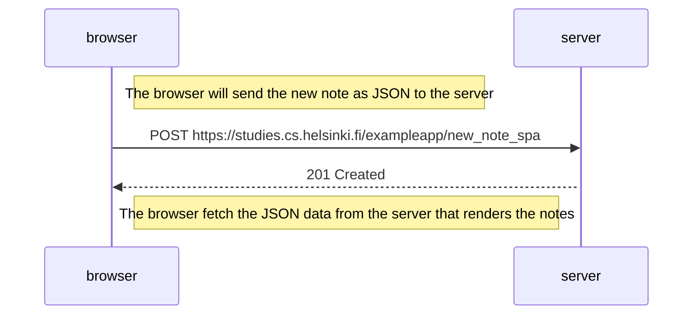

```mermaid
sequenceDiagram
    participant browser
    participant server

	Note right of browser: The browser will send the new note as JSON to the server
    browser->>server: POST https://studies.cs.helsinki.fi/exampleapp/new_note_spa

	activate server
	server-->>browser: 201 Created

    Note right of browser: The browser fetch the JSON data from the server that renders the notes
```
